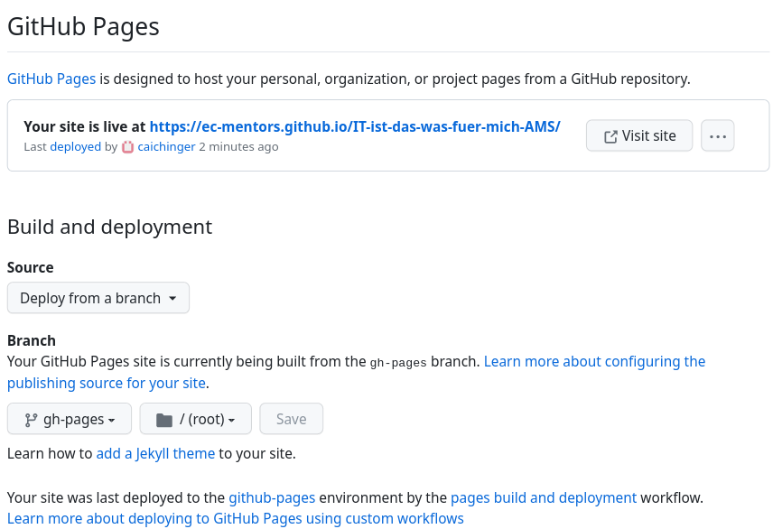

# IT, ist das was für mich?

Course notes and material for "IT, ist das was für mich?".

## Website

The website serves as entry point for the participants and
helps organize course notes as well as additional material
relevant for the participants.

### Technical Background

The website is markdown-based and rendered using a static site generator.

The following tools are at play:

* [Sphinx](https://www.sphinx-doc.org/)
* [Sphinx Book Theme](https://sphinx-book-theme.readthedocs.io/)
* [Markedly Structured Text (MyST)](https://myst-parser.readthedocs.io/)

Sphinx is a mature, feature rich, versatile and extensible documentation generator.

While Sphinx is based on reStructuredText (reST), different markup languages are
supported either natively or through plugins.
The MyST parser allows for a more markdownish-writing experience.

The sphinx book theme is responsible for the appearance of the site.

Extensions are specified in the Sphinx configuration file `conf.py`.

The listed tools are used within the [executable books project](https://github.com/executablebooks).

### Setup

Use your favorite method to create a (virtual) Python environment
based on the specifications in `environment.yml` or `requirements.txt`.
Take a look at the CI workflow, i.e. `.github/workflows/gh-pages.yml` (or `.gitlab-ci.yml`).

### Editing

Source files reside in the `sources/` directory and are written using the
Markdown flavor [Markedly Structured Text (MyST)](https://myst-parser.readthedocs.io/en/latest/)
which is a superset of [CommonMark Markdown](https://commonmark.org/).

To make changes, edit the already existing files or add a new document.

New documents need to be included through a `toctree` directive.

Take a look at both MyST and the theme to learn more about how to write content.
To better understand the underlying principles, take a look at Sphinx.

### Rendering/Building

To build locally, do

```console
./render.sh
./render_on_save.sh
```

### CI Pages

A CI pipeline is configured and the build is automatically published.

## Slides

### Technical Background

Slides are markdown-based and rendered using [Marp](https://marp.app/).

Notes:

* To include slides on the website, add the PDF version as download.
* Any markdown engine could be used.

### Setup

#### VS Code Plugin

There is a [VS Code plugin](https://marketplace.visualstudio.com/items?itemName=marp-team.marp-vscode)
for local development and building.

#### Marp CLI

There is a [CLI that can be installed through npm](https://www.npmjs.com/package/@marp-team/marp-cli).

```console
$ npm install -g @marp-team/marp-cli
```

### Editing

Source files reside in the `sources/course/days_*/slides.md` and are written in
[Markdown](https://marpit.marp.app/markdown).

### Rendering/Building

To convert a markdown file into e.g. PDF, do

```console
$ marp slides.md -o slides.pdf
$ npx @marp-team/marp-cli@latest slides.md -o slides.pdf  # included marp update
```

or use the VS Code plugin.

To simplify automation, use the SlidesMakefile.

```console
$ make --makefile=SlidesMakefile all  # to compile all slides
$ make --makefile=SlidesMakefile clean  # to remove them
$ make --makefile=SlidesMakefile help  # to see other options
```

### Spell Checking

[CSpell](https://cspell.org/) can be used for spell checking.

There is an
[extension for VS Code](https://marketplace.visualstudio.com/items?itemName=streetsidesoftware.code-spell-checker)
as well as
[dictionary for German](https://marketplace.visualstudio.com/items?itemName=streetsidesoftware.code-spell-checker-german)
and
[dictionary for Austrian German](https://marketplace.visualstudio.com/items?itemName=streetsidesoftware.code-spell-checker-austrian-german).

### Building Everything

`$ ./render_all_and_check_link.sh` to render both slides and website in one go.

## New Intake Actions

In this sections we briefly describe the required actions when a new intake
starts.

1. Rename old repository and old team (to free names)
1. Create new repository and new team
1. Copy-paste old website into new repository, thereby
   * Discarding the Git-history
   * Deleting participant-related content
   We do that to avoid storing participant-related information
   longer than necessary.
1. Migrate issues (if any) to new project
1. Delete old repository and old team (if not done already)

To activate *GitHub Pages*:
On *GitHub / Settings / GitHub Pages* select

* Source: Deploy from branch
* Branch: gh-pages / (root) *Save*



## Miscellaneous

### Compressing Images

For example like this:

```console
$ convert original.jpg -quality 50% compressed.jpg
```

### Creating Participant Pages

* add all participants' names to ```internal.py```
* run

```console
$ python3 internal.py
```
