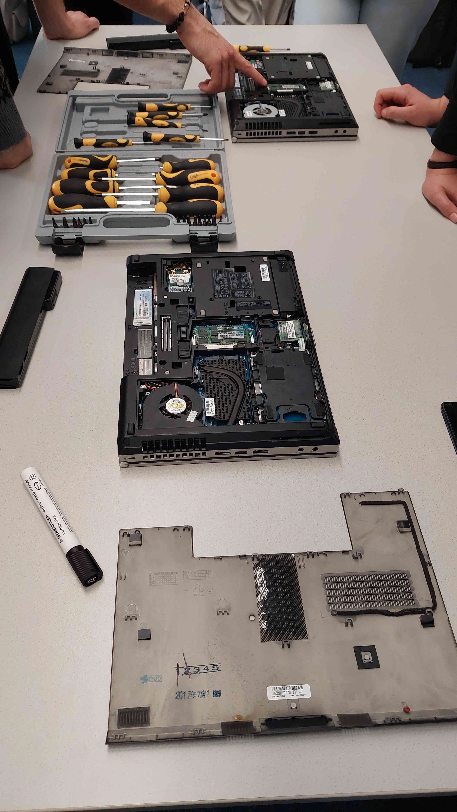
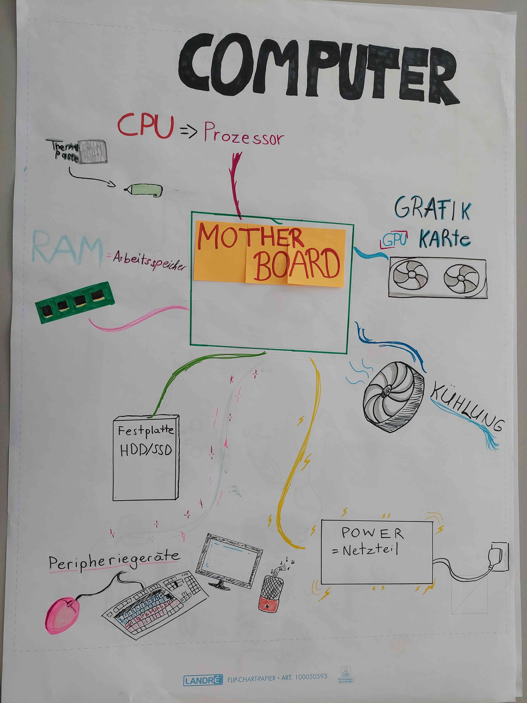

# Tag 2: Grundbegriffe, Laptops, Computer

**Wir zerlegen einen Computer!** 🧰 🪛 💻

Heute werden wir Computer zerlegen und uns anschauen, woraus sie bestehen.
Dabei schauen wir uns auch an, wie man diese Bestandteile beschreiben und miteinander vergleichen kann.

% 

% 

{download}`🎬 Slides <./slides.pdf>`

% Idee: Festplatte, RAM und CPU mit verteilten Rollen
