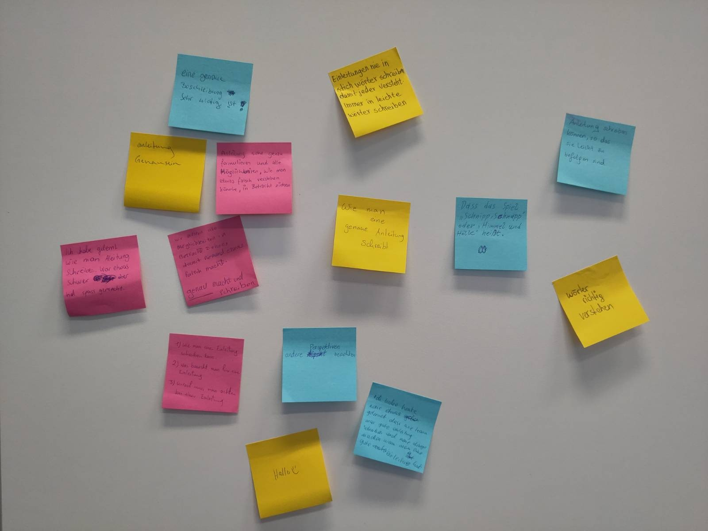

# Tag 3: Aufgaben, Anleitungen, Algorithmen

**Wir verfassen Anleitungen!** 🤓 📝

Wenn es darum geht ein Projekt umzusetzen, braucht es zunächst einmal:

1. eine konkrete Idee und
2. einen Plan.

Für uns steht heute der Plan im Vordergrund.

Wir wollen also versuchen, Aufgaben so verständlich und präzise zu beschreiben,
dass eine andere Person die von uns gewünschte Tätigkeit ausführen kann.

Bevor es richtig los geht, wiederholen wir, was wir gestern gemacht haben.

Das habt ihr gelernt:

% {download}`🎬 Slides <./slides.pdf>`
