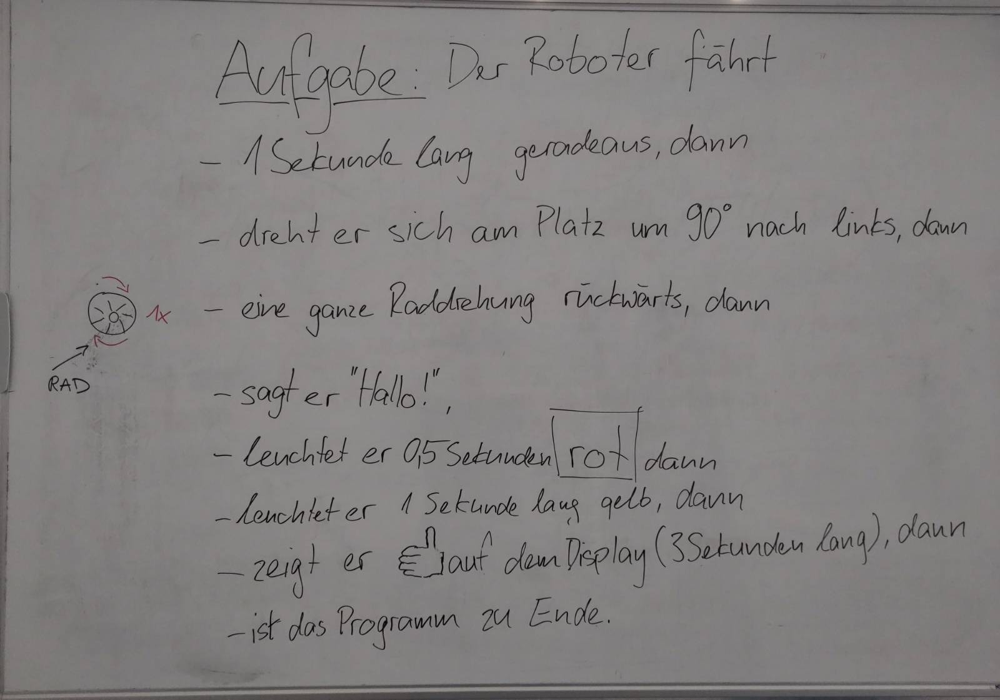

# Tag 5 bis 9: Lego Roboter EV3

**Wir programmieren!** 🤓 📝

{download}`🎬 Slides <./slides.pdf>`

<!--
**Tag 5**

Heute geht es darum, dass du deine ersten Programme schreibst. Du hast letzte Woche schon gelernt was ein Algorithmus ist und was eine Anleitung ist, das werden wir vertiefen.

{download}`Slides <./Tag05_Einstieg_EV3.pptx.pdf>`

**Tag 7**

Heute werden wir das gelernte anwenden. Dafür gibt es ein Spielfeld, welches du im Klassenraum findest.

Deine Aufgabe für den ersten Teil des Vormittages wird sein:
* Schau dir das Spielfeld an
* Auf Youtube gibt es zu allen Aufgaben Erklärungen, schau dir die Videos an
* Suche dir eine der Aufgaben aus (gerne auch mit einer zweiten Person)
* beschreibe die Aufgabe
* schreibe eine Anleitung für den Roboter, noch nicht programmieren!
-->
