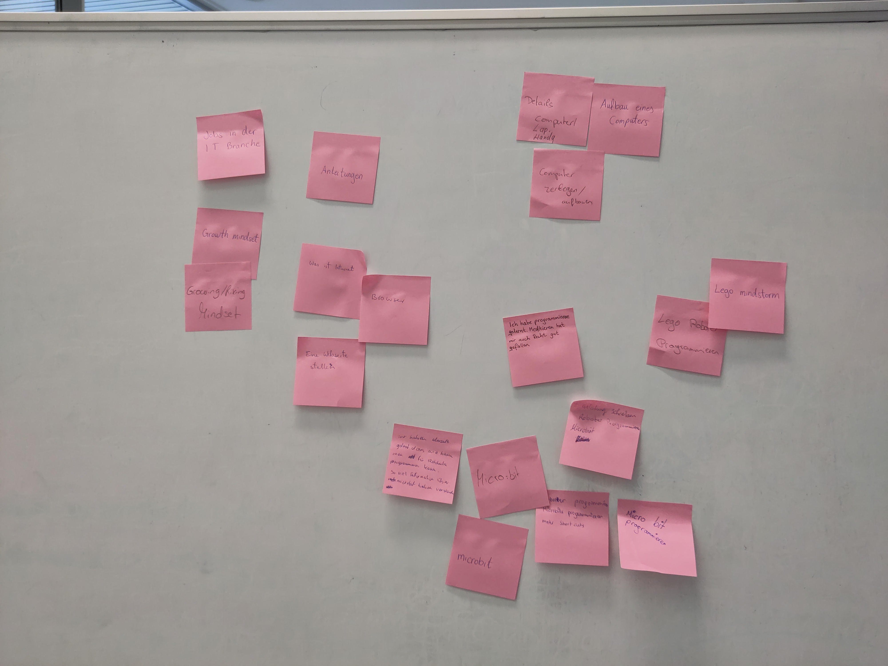
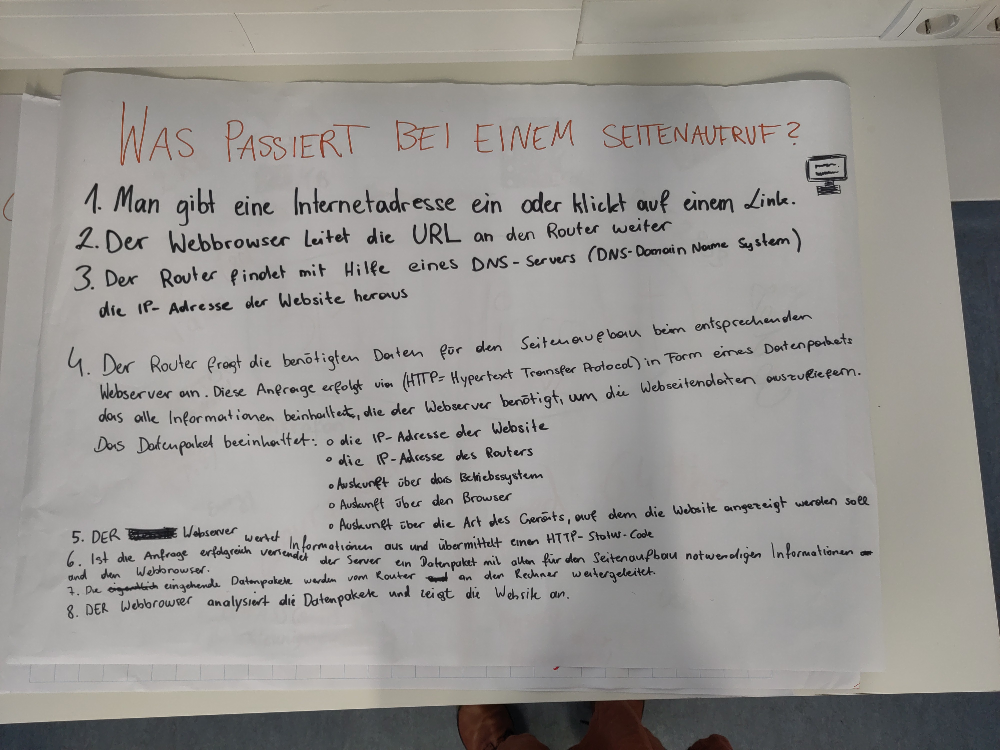
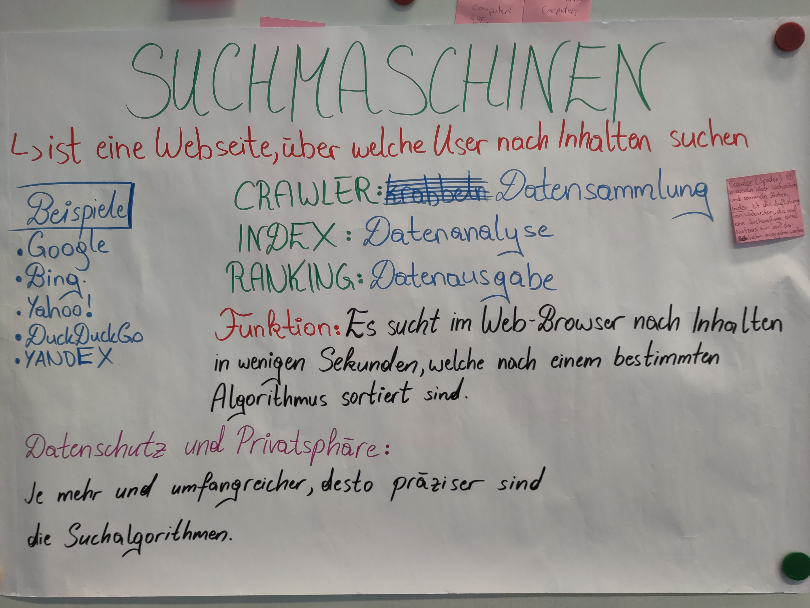
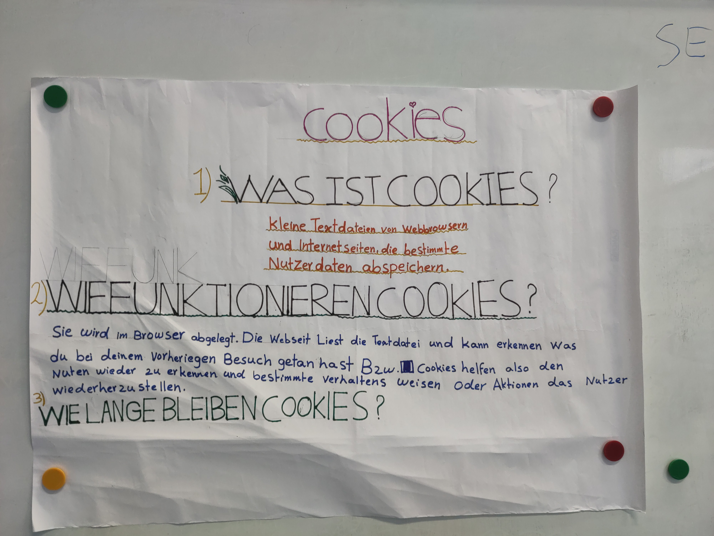

# Tag 15: Web

Wir haben bisher schon viel gelernt! Hier sind eure Eindrücke.

## Interessantes rund ums Internet 🌐 💻

Wir haben schon den Unterschied zwischen Suchmaschine, Browser und Internet besprochen:

- Das **Internet** ist ein Netzwerk von vielen Computern auf der ganzen Welt. Das **World Wide Web** ist ein Teil vom Internet.
- Der **Browser** ist ein Programm, mit dem man Seiten im World Wide Web aufrufen kann.
- Auf einigen dieser Seiten kann man auf **Suchmaschinen** zugreifen. Sie geben uns eine Liste von Webseiten zu unserer Suchanfrage an.

Wie funktioniert aber so eine Suchmaschine? Was passiert hinter den Kulissen, wenn man eine Seite im Browser aufruft? Was sind diese Cookies, die man ständig akzeptieren soll? Und wie privat ist dieser Inkognito-Modus im Browser eigentlich?

Wir machen heute folgende Übungen:

- {ref}`exercise-request-website`
- {ref}`exercise-how-search-engines-work`
- {ref}`exercise-what-are-cookies`
- {ref}`exercise-incognito-browser`
% - {ref}`exercise-what-is-cloud`

Die Ergebnisse sind dann hier zu finden:

- [Seitenaufruf](../../web/seitenaufruf_www.md)
- [Suchmaschinen](../../web/suchmaschinen.md)
- [Cookies](../../web/cookies.md)
- [Inkognito-Modus](../../web/inkognito.md)

Und die Poster zu den Präsentationen sind hier:

 

 

 
Inkognito-Modus: TBD
