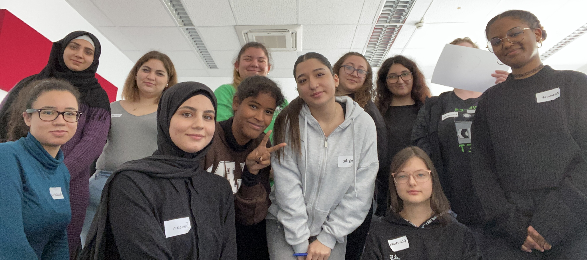

# IT, ist das was für mich?

% 

```{toctree}
:caption: Arbeitsmaterialien für den Kurs
:maxdepth: 1

course/index
participants/index
mode

lego/index
% raspberrypi
% microbit/index
website
projects/projects
learning

orientation
education
guests/guests

contact
```

🚧 **Diese Seite wird im Laufe des Kurses kontinuierlich aktualisiert.** 👷‍♀️
