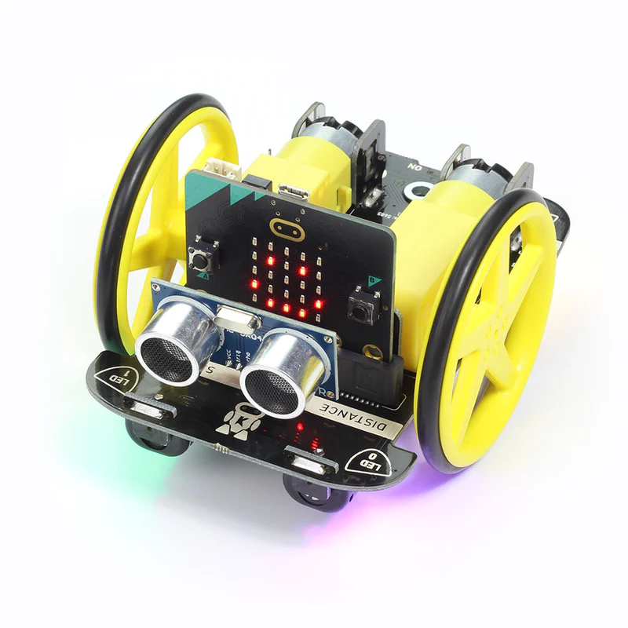

# Erweiterungen für den Micro Bit

## E-Textiles 👕

Lust auf Kleidung?

Rote und weiße LEDs die du aufnähen und dann mit dem Micro Bit einzeln oder gemeinsam ansteuern kannst.

Weitere Details findest du [hier](https://kitronik.co.uk/collections/e-textiles-conductive-thread/products/5607-e-textiles-kit-for-the-bbc-microbit).

## Move Motor 🤖

Lust auf Roboter?

Mit dieser Erweiterung kannst du den Mikro Bit verwenden um
einen Roboter zu bauen.

Neben zwei getrennt steuerbaren Motoren gibt es Ultraschallsensoren
zur Abstandsmessung, einen Lichtsensor zum Linien-Folgen sowie
ein kleines Mikrofon und einzeln steuerbare LEDs.

Weitere Details findest du [hier](https://kitronik.co.uk/collections/accessories-for-the-bbc-micro-bit/products/5683-kitronik-move-motor-for-the-bbc-micro-bit).

Um diese Erweiterung in MakeCode verfügbar zu machen:
1. Fortgeschritten/Advanced
2. Erweiterungen
3. Füge https://github.com/waveshare/TouchPiano im Suchfeld ein
4. Clicke auf das Sucherergebnis zum Hinzfügen

## Game Zip 🕹️

Lust auf Spiele?

Diese Erweiterung bietet ein größeres Display aus 8x8 farbigen LEDs,
mehrere Eingabeknöpfe und sogar Ton sowie Vibration.

Damit kann man Spiele wie beispielsweise Snake oder Pong spielen.

Weitere Details findest du [hier](https://kitronik.co.uk/collections/coding/products/5626-game-zip-64-for-the-bbc-microbit).

Um diese Erweiterung in MakeCode verfügbar zu machen:
1. Fortgeschritten/Advanced
2. Erweiterungen
3. Suche nach "kitronik-zip-64"
4. Clicke auf das Sucherergebnis zum Hinzfügen

## Touch Piano 🎹

Lust auf Musik?

Mit dieser Erweiterung kann man Musik machen.
Neben den Klaviertasten gibt es auch farbige LEDs.

Weitere Details findest du [hier](https://www.waveshare.com/piano-for-micro-bit.htm).

## ZIP Halo 🌈

Lust auf Animation und bunte Farben?

24 farbige, in einem Kreis angeordnete, LEDs die einzel angesteuert
werden können.

Weitere Details findest du [hier](https://kitronik.co.uk/products/5625-zip-halo-for-the-bbc-microbit)
