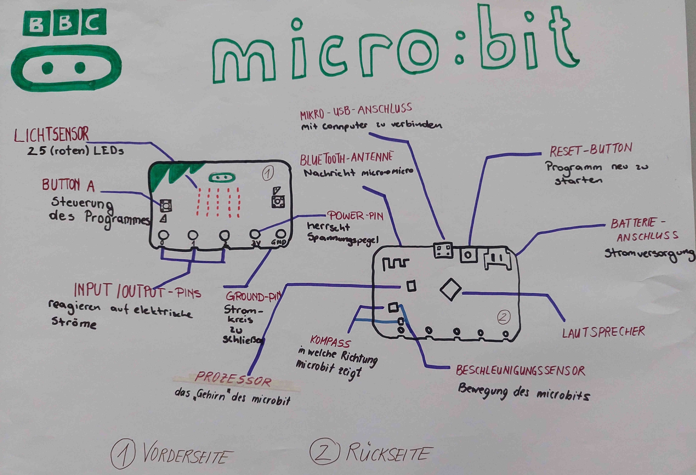
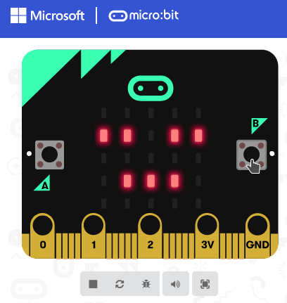
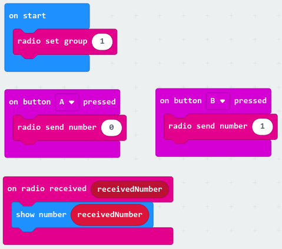
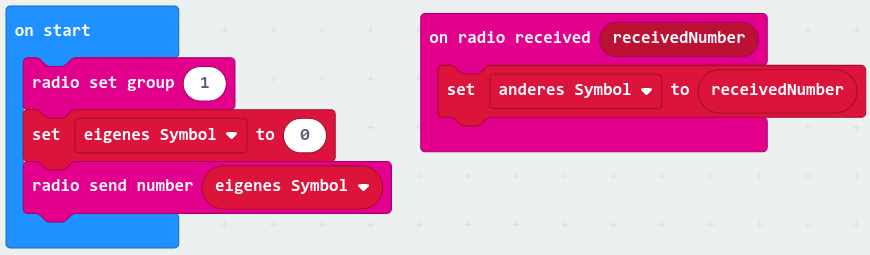
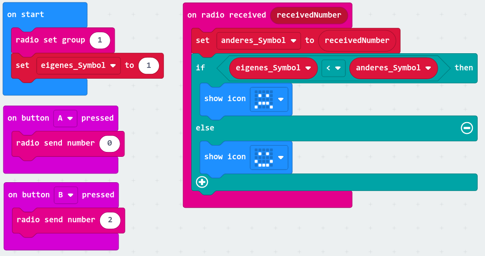
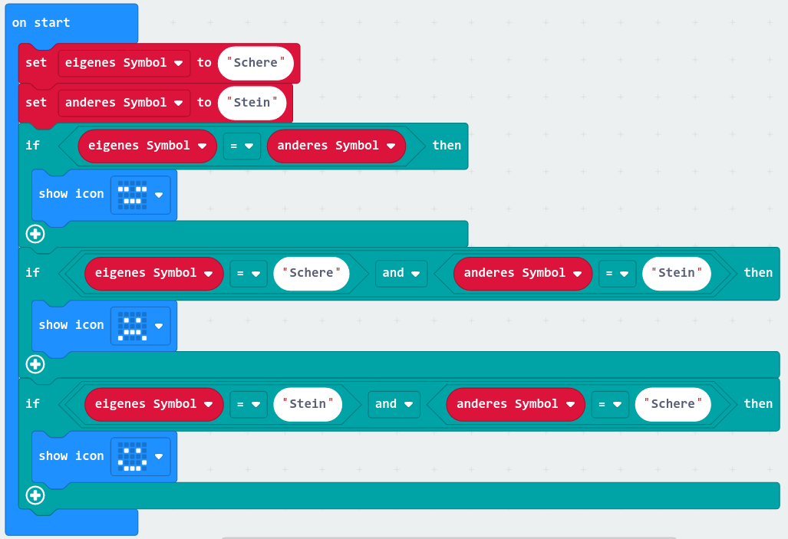

# Tutorial

Der Microbit ist ein vielseitig programmierbarer Einplatinencomputer.


Wichtige Links:

- [BBC Microbit Webseite](https://microbit.org/)
  - [Let's code](https://microbit.org/code/) für Links zu Editoren und dem Classroom
- [Microsoft Make Code für Microbit](https://makecode.microbit.org/)

## Hardware

Bevor wir mit dem Programmieren loslegen, wollen wir uns die
Hardware genauer anschauen und versuchen, den Microbit zu
beschreiben.

Für die nun folgenden Übungen könnt ihr ein Poster gestalten, die Antworten
auf einem Blatt Papier sammeln oder in einem Google Doc eintragen.

```{exercise} Microbit Kennzahlen
:label: exercise-micro-bit-numbers

Der Microbit ist ein Computer.
Wir wissen also, dass es einen Prozessor und irgendeine Form von Speicher geben muss.

Recherchiere und versuche folgende Fragen zu beantworten:
* Welche Rechenleistung hat der Prozessor?
* Wie viel Arbeitsspeicher gibt es?
* Wie groß ist die Speicherkapazität?

Wofür sind diese drei Größen wichtig?
```

```{exercise} Microbit Schnittstellen, Sensoren, ...
:label: exercise-micro-bit-interface-and-sensors

Der Microbit ist mit diversen Schnittstellen, Sensoren und weiteren Fähigkeiten
ausgestattet.

Schaue dir das Gerät genau an und versuche ihn zu beschreiben.

Beantworte dabei auch die folgenden Fragen:
* Welche Schnittstellen gibt es?
* Was für Sensoren gibt es und was kann man mit ihnen messen?
* Welche Möglichkeiten gibt es um mit dem Gerät zu interagieren?
```

<!---->

## Software

Wenn der Microbit tun soll, was wir wollen, müssen wir ein Programm
schreiben, das genaue Anweisungen gibt.
Überblicksmäßig muss folgende passieren:

1. Programmieren: Wir erstellen ein Programm
1. Kompilieren: Das Programm wird in eine Form gebracht die der Prozessor versteht
1. Kopieren: Wir übertragen das kompilierte Programm auf den Microbit
1. Ausführen: Der Microbit führt das Programm aus

## Erste kleine Programme 🐣

Es gibt verschiedene Möglichkeiten Programme für den Microbit zu schreiben
und wir werden diese auch noch kennen lernen.

Die ersten Schritte gehen wir alle gemeinsam (mit Hilfe des [Microbit Classrooms](https://microbit.org/join)).
Danach kann jede für sich eigene Projekte mit [Microsoft Make Code Microbit](https://makecode.microbit.org/) anlegen.

```{exercise} Flashing Heart 💗
:label: exercise-micro-bit-flashing-heart

Wir wollen den Microbit so programmieren, dass die LED-Matrix ein
blinkendes Herz anzeigt.


```

```{exercise} Name Tag (Namenskärtchen) 📛
:label: exercise-micro-bit-name-tag

Wir wollen den Microbit so programmieren, dass er unseren Vornamen anzeigt.


```

Wir können das kompilierte Programm (HEX-Datei) händisch herunterladen und auf den Microbit
kopieren. Das geht auch etwas einfacher.

```{exercise} Chrome & WebUSB Unterstützung
:label: exercise-micro-bit-chrome-webusb

Schritte:
1. Installiere Google Chrome als neuen Browser
1. Verwende Chrome um ein neues Programm via Make Code zu erstellen
1. Im Download-Menü (...) oder im Einstellungsdialog ⚙️ wähle "pair device" und folge den Anweisungen
1. Überspiele das Programm direkt

Wenn du keinen neuen Browser installieren möchtest, kannst du zuerst
auch einen Blick in [hierher](https://caniuse.com/webusb) werfen und probieren,
ob WebUSB mit einem anderen Browser klappt.
```

## Etwas größere Aufgaben 🐤

In den obigen Beispielen ergab sich das Programm sehr direkt.
Wir haben den passenden Block gewählt und waren fast schon fertig.
Wir werden uns nun ansehen, wie man etwas größere Programme aus
kleinen Einzelteilen zusammen setzen kann.

### Zahlen würfeln? 🎲

```{exercise} Dice (Würfel)
:label: exercise-micro-bit-dice

Wir wollen den Microbit so programmieren, dass man ihn verwenden kann wie einen Würfel:
Wenn man ihn schüttelt, soll er eine zufällige Zahl anzeigen.


Fragen:
* Welche Blöcke brauchen wir?
* Wie hängen sie zusammen?
```

Wir probieren jetzt eine Abwandlung des obigen Programms.
An stelle von Zahlen, könnte man ja auch zufällige Emojis anzeigen, oder?

### Emojis würfeln? 🎲 + 😃 = ❓

Du weißt wie man einen Würfel baut und Symbole anzeigt.
Kannst du das verbinden und an Stelle von Zahlen Emojis würfeln?

```{exercise} Emoji-Dice (Emoji-Würfel)
:label: exercise-micro-bit-emoji-dice

Wenn man den Microbit schüttelt, soll jedes Mal ein anderes Emoji angezeigt werden.

Fragen:
* Was ist anders im Vergleich zum Würfel?
* Welchen Teil vom Programm muss man deiner Meinung nach ändern?
* Wie könntest du "zufälliges Emoji" im Programm ausdrücken?
```

Wir haben soeben eine wichtigen Schritt getan:
Wir haben aus den bestehenden Grundbausteinen etwas neues geschaffen!

Wir werden nun die Ideen und Konzepte der vorherigen Übungen weiter aufgreifen und
noch die Möglichkeit von User Input durch Buttons berücksichtigen.

### Retrospektive mit Emojis? 🤔

Wir wollen ein Programm schreiben, über das wir anzeigen können, wie es uns
geht oder wie uns der Tag gefallen hat. Wenn wir etwas gut finden, könnten wir
einen 😃 anzeigen und wenn wir nicht so
überzeugt sind bspw. einen 😐 darstellen.

```{exercise} Emoji-Stimmung
:label: exercise-micro-bit-retrospective

Die Stimmung soll man über die Buttons auswählen können.

Das gewünschte Verhalten siehst du hier:



Aufgaben und zu beantwortende Fragen:

1. Beschreibe das Verhalten in Worten
1. Gibt es eine vereinfachte Aufgabe, die leichter umzusetzen ist? Kann du zunächst mit dieser anfangen?
1. Welche Blöcke wirst du brauchen?
1. Wie hängen die Blöcke zusammen?

Skizziere das Programm auf Papier oder einem Whiteboard.
Versuche dir zuerst Gedanken zu machen und die obigen Fragen
zu beantworten und erst dann den Code zu erstellen.

Bei Fragen oder Unklarheiten einfach melden.
```

### Mehr Sensoren 🤹

Bis jetzt haben wir nur einen kleinen Ausschnitt der Funktionen
des Microbits verwendet.
Das wollen wir nun ändern.

```{exercise} Microbit Sensoren entdecken (60 Minuten)
:label: exercise-microbit-sensor-discovery

Entscheide dich für einen der Sensoren, den wir noch nicht verwendet haben.

**Fragen**
- Wofür könnte man diesen Sensor verwenden?
- Wo kommen solche Sensoren zur Anwendung kommen und warum?
- Wie verwendet man ihn beim Microbit?

**Erstelle ein A4 Miniplakat zu diesem Sensor**
- Was macht der Sensor?
- Wofür ist er gut?
- Gib Anwendungsbeispiele

**Programmiere den Microbit**
- Überlege dir eine kleines Programm, das den Sensor verwendet.
  Das Programm soll helfen, den anderen Teilnehmerinnen zu zeigen,
  wofür der Sensor gut ist und wie man ihn verwendet.
- Programmiere den Microbit.

**Präsentation**
- Präsentiere dein Miniplakat und zeige, was dein Microbit macht.
- Beantworte Fragen der anderen Teilnehmerinnen
```

### Microbits verbinden 📡🤝

Wir können Microbits per Funk miteinander verbinden, so dass diese
untereinander Informationen austauschen können.

Nachdem das ein wenig verwirrend sein kann, wollen wir uns das
in Ruhe ansehen.

```{exercise} Radio
:label: exercise-basic-radio

Wir wollen zwei Microbits miteinander verbinden.
Wenn man auf einem Microbit einen Button drückt, soll das auf dem
anderen angezeigt werden.

Aufgaben und Fragen:
1. Welche Blöcke gibt es in der Rubrik "Radio"?
1. Welche Blöcke brauchen wir noch?

Hinweis:
* Damit klar ist, welche Microbits miteinander kommunizieren (und welche nicht),
wählt man eine Gruppe aus. Informationen werden dann innerhalb dieser Gruppe ausgetauscht.
* Im Simulator gibt es zwei Microbits aber nur ein Programm.
  Versuche in der Ich-Perspektive zu bleiben.
```

% ```{solution} exercise-basic-radio
% :class: dropdown
%
% 
% ```
%
% Datenaustausch zwischen zwei Microbits:
% * 
% * 

## Eine große Aufgabe 🧗

Wir werden uns nun länger mit ein und derselben Aufgabe befassen.
Konkret wollen wir das Spiel "Schere, Stein, Papier" mit dem Microbit
umsetzen.
Das ist schon eine Herausforderung und wir werden uns daher folgende Fragen stellen:

- Was kann ich tun, wenn ich nicht mehr weiter weiß?
- Wie gehe ich damit um, wenn das Lösen einer Aufgabe länger dauert?
- Welche Problemlösungsstrategien gibt es?

### Schere, Stein, Papier ✂️ + 🪨 + 📑 = ❓

Kennst du das Spiel Schere, Stein, Papier?

Es gibt einen Wikipedia dazu:

- [Deutsch](https://de.wikipedia.org/wiki/Schere,_Stein,_Papier)
- [Arabisch](https://ar.wikipedia.org/wiki/%D8%AD%D8%AC%D8%B1-%D9%88%D8%B1%D9%82-%D9%85%D9%82%D8%B5)
- [Farsi](https://fa.wikipedia.org/wiki/%D8%B3%D9%86%DA%AF-%DA%A9%D8%A7%D8%BA%D8%B0-%D9%82%DB%8C%DA%86%DB%8C)


Im Laufe der nächsten Kurstage wollen wir Schere-Stein-Papier
mit dem Microbit umsetzen.
Das heißt:
- Wir verbinden zwei Microbits
- Wir schütteln drei Mal
- Jeder Microbit zeigt ein zufälliges Symbol an
- Der eine gewinnt, der andere verliert

Wie können wir diese Aufgabe angehen?


```{exercise} Spiel kennen lernen
:label: exercise-rock-paper-scissor-part-1-reading

Zu Beginn wollen wir noch gar kein Programm schreiben
sondern uns mit dem Spiel selbst vertraut machen.

Falls du das Spiel nicht kennst, lies dir die den Artikel
auf Wikipedia durch.

Aufgaben:
1. Suche dir eine Partnerin.
1. Spielt das Spiel ein paar Mal.
   * Wisst ihr, man es spielt?
   * Gibt es eine Strategie, mit der man öfter gewinnen kann?
   * Versucht zu beschreiben was ihr tut, während ihr das Spiel
     spielt (auch wenn sich das komisch anfühlt).
1. Versucht eine Anleitung zu schreiben, wie man das Spiel
   spielt.
1. Vergleiche deine Anleitung mit der Beschreibung
   auf Wikipedia.

Fragen:
- Wie ist es dir dabei gegangen eine Anleitung zu schreiben?
- Hast du auch versucht Skizzen zu machen?
```


```{exercise} Aufgabe analysieren
:label: exercise-rock-paper-scissor-1-description

In aller Kürze könnte man das Spiel so beschreiben:
1. Wir verbinden zwei Microbits
1. Wir schütteln drei Mal
1. Jeder Microbit zeigt ein zufälliges Symbol an
1. Der eine gewinnt, der andere verliert

Das Programm, das wir später erstellen wollen, muss
alle diese Dinge tun.

Wie können wir so ein Programm umsetzen?

Wir haben verschiedene Strategien besprochen um Probleme
zu lösen:
- Kannst du das Problem vereinfachen? Wie?
- Kannst du das Problem in Teilprobleme zerlegen? Welche?
- Kannst du den Ablauf beschreiben? Mit Worten oder Zeichnungen? Versuche es.
- Kannst du jemandem die Aufgabe im Detail beschreiben?
  Suche dir eine Partnerin und probiere es.

Wenn du dir nicht sicher bist, Spiele das Spiel noch
einmal mit jemandem und beschreibt gleichzeitig was ihr tut.
```


```{exercise} Aufgabe zeichnen
:label: exercise-rock-paper-scissors-1-diagram

Oft sagt ein Bild mehr als tausend Worte.
Wir wollen daher noch einen Anlauf unternehmen und versuchen, das Spiel
in ein Bild zu fassen.
Unser Ziel ist dabei, den Spielablauf zu beschreiben und einzelne
Teile der Aufgabe zu erkennen.

Erstelle eine Zeichnung aus der man ablesen kann:
- Wann passiert etwas? Zeitlicher Ablauf.
- Warum passiert etwas? Logischer Ablauf.
- Gibt es wichtige Ereignisse, Schritte oder "Dinge" die für den
  Ablauf wichtig sind (bspw. "schütteln", "3 Mal", ...)?s", ...)

Verwende gerne Farben, Pfeile, Nummerierungen, Sprechblasen, Symbole oder
andere Hilfsmittel die es dir leichter machen, die Zusammenhänge zu beschreiben.
```

Wenn wir das Gefühl haben, die Aufgabe verstanden zu haben,
können wir probieren sie Schritt für Schritt zu lösen.
Oft merken wir dann, dass wir uns doch ein paar Details unklar sind.
Das ist okay.


```{exercise} Teilaufgaben umsetzen
:label: exercise-rock-paper-scissor-2-implementation

Wir wollen versuchen Schere-Stein-Papier zu programmieren.

Wir halten uns weiterhin an unser Motto

> Kleine Schritte, Stück für Stück

Versuche ganz bewusst zuerst einmal nur kleinere Teilaufgaben
zu lösen. Wenn das klappt, füge sie zu einem Ganzen zusammen.


**Aufgaben:**
Für jedes Teilproblem oder jede Vereinfachung:
1. Worin besteht die Aufgabe?
1. Welche Blöcke brauchst du?
1. Setze die Blöcke Schritt für Schritt zusammen und prüfe
   bei jeder Änderung, ob alles so funktioniert, wie du dir
   das vorstellst.
```


```{exercise} Regeln anwenden
:label: exercise-rock-paper-scissor-2-rules

Wer gewinnt und wer verliert wird durch Regeln beschrieben.

Wenn wir diesen Teil des Programms umsetzen wollen, müssen
wir uns für eine Sichtweise entscheiden.

Es macht Sinn, das Programm aus der Ich-Form zu schreiben.

**Aufgaben und Fragen:**
1. Wie lauten die Regeln?
1. Wie beschreibst du "das Ergebnis vom Schütteln" für jede
   Spielerin?
1. Was soll passieren, wenn man gewonnen oder verloren hat?
1. Versuche ein Programm zu schreiben, das die Regeln anwendet.
```

% 


```{exercise} Schere-Stein-Papier
:label: exercise-rock-paper-scissors-all-in-one

Wenn du alle Teilaufgaben gelöst hast, versuche die einzelnen
Teile zu einem Ganzen zusammen zu fügen.

Wenn dir noch ein Teil fehlt, erstelle diesen zuerst separat.

Ihr könnte dazu gerne auch im Team arbeiten. Wenn ihr das tut, vergesst nicht:
* Regelmäßig abwechseln und
* aussprechen was ihr tun wollt! 😃
```


### E-Textile mit dem Microbit: 👟 👕 + 💻 + 💡 = ❓

Der Microbit hat diverse Schnittstellen.
Über diese Schnittstellen, kann man zusätzliche Geräte anschließen.

Man kann beispielsweise kleine Lampen (LEDs) anschließen und über den
Microbit steuern.

Hast du Ideen, was man damit alles machen könnte?

```{exercise} E-Textile Ideensammlung und Konzepte
:label: exercise-micro-bit-e-textile-1

*In dieser Übung wird noch nicht programmiert, das kommt später.*

Ihr habt einen Microbit, diverse LEDs und einen elektrisch leitenden Faden.
Damit könnt ihr beispielsweise einen Schuh oder eine Tasche zum Leuchten
bringen.

Diskutiert gemeinsam und arbeitet einen Vorschlag aus:
* Was für Ideen fallen euch ein?
* Welche davon würdet ihr gerne umsetzen?

Beschreibt eure Idee im Detail:
* Wie sieht sie aus?
* Welche Aufgaben übernimmt der Microbit?
* Wie könnte das Programm aussehen?

Präsentiert eure Idee der Gruppe.
```
