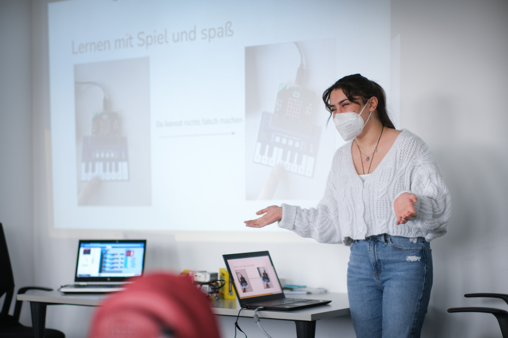

# Projekte & Konzepte

(_project_ideas_target)=
## Projektideen

In den vergangenen Wochen haben wir viel gemacht:

* Du hast Computer zerlegt.
* Du hast mit dem Lego Roboter Aufgaben gelöst.
* Du hast mit dem Microbit kleine Anwendungen umgesetzt.
* Du hast auch Webseiten mit Markdown und HTML erstellt.

Jetzt hast du die Gelegenheit, dein persönliches Projekt zu starten.

> **Worauf hast du Lust?**



> **Trau' dich, was ganz eigenes zu machen!**


Du hast viele Möglichkeiten, wir unterstützen dich bei allem, was du
machen möchtest:

* Möchtest du noch mehr Lego Challenges lösen?
* Möchtest du mit den Sensoren des Microbits etwas erfinden?
* Möchtest du mit den Erweiterungen zum Microbit was eigenes bauen?
* Möchtest du mit dem Microbit ein kleines Spiel programmieren?
* Möchtest du eine Programmiersprache wie Javascript oder Python ausprobieren?
* Möchtest du eine kleine Webseite erstellen?
* **Möchtest du ganz was anders machen? Go for it!**

```{exercise} Projektideen sammeln
:label: exercise-collect-project-ideas

Was wird dein Projekt sein?

Sammle deine Ideen und bereite sie so auf, dass du sie in einer
kleinen Präsentation der Gruppe vorstellen kannst.

Beantworte für jede deiner Ideen die folgende Frage:
* Worum geht es?
* Warum interessierst du dich dafür?
* Was glaubst du wird in etwa zu tun sein, um sie umzusetzen?
* Wie können wir dich dabei unterstützen?

Besprich dich mit deine Nachbarin zusammen, wenn dir das hilft.

Setze dich mit einer anderen Kursteilnehmerin, mit der du noch nicht
zusammen gearbeitet hast, wenn du was neues ausprobieren möchtest.
```

